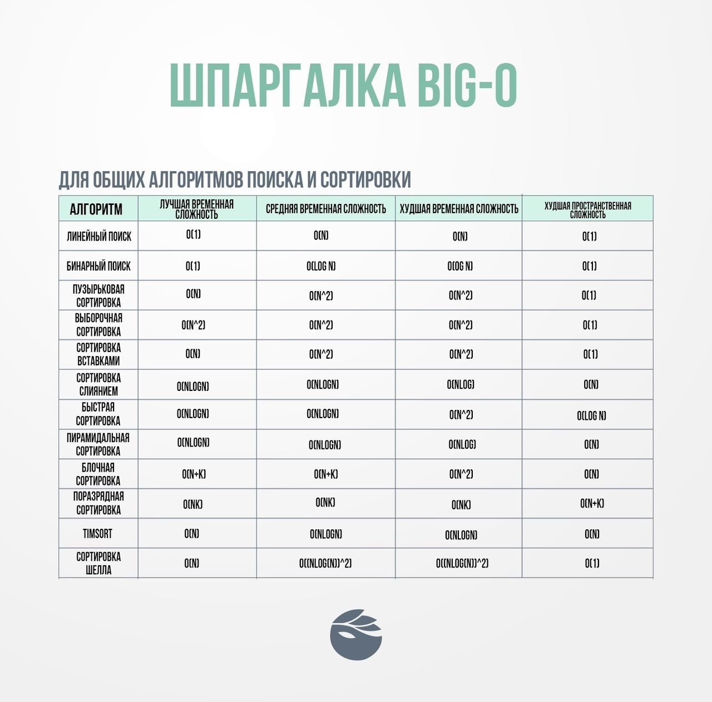
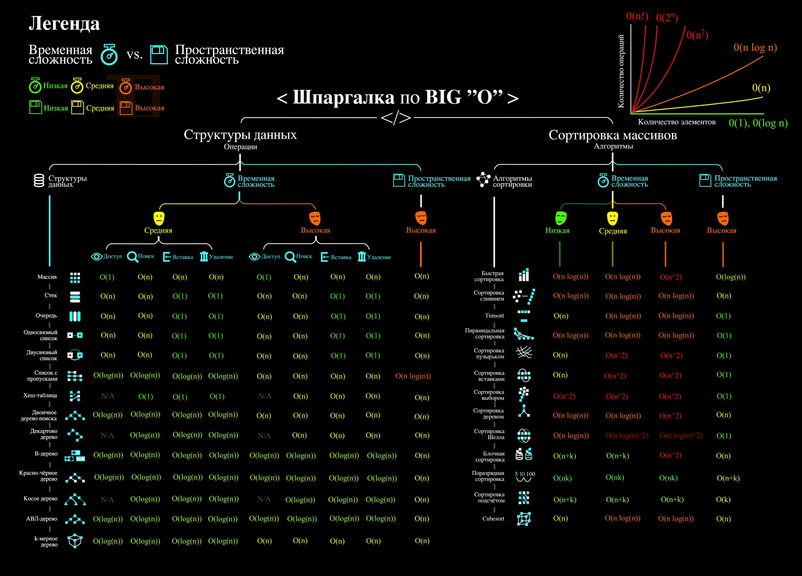

Сложность алгоритма можно классифицировать по следующим категориям:

1. O(1) - константная сложность, время выполнения не зависит от размера входных данных.

2. O(log n) - логарифмическая сложность, время выполнения растет медленно при увеличении размера входных данных.

3. O(n) - линейная сложность, время выполнения пропорционально размеру входных данных.

4. O(n log n) - сложность n умноженная на логарифм от n, используется в сортировках и других алгоритмах.

5. O(n^2) - квадратичная сложность, время выполнения растет квадратично при увеличении размера входных данных.

6. O(2^n) - экспоненциальная сложность, время выполнения растет очень быстро при увеличении размера входных данных.

7. O(n!) - факториальная сложность, самая медленная из всех, используется редко.

Определение сложности алгоритма помогает выбирать наиболее эффективный алгоритм для решения задачи. Чем меньше сложность алгоритма, тем быстрее он будет работать на больших объемах данных.

