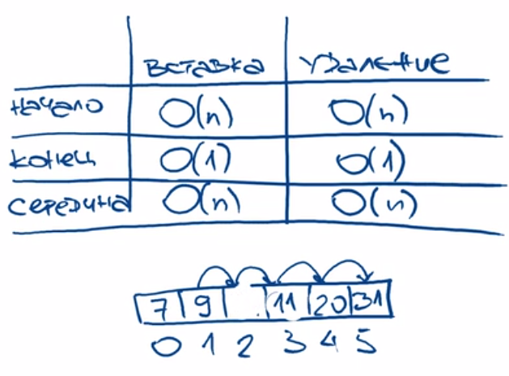

> При обращении к ненулевому индексу берём адрес нулевой ячейки прибавляем к ней число искомого индека умноженное на размер ячейки

> Константный доступ по индексу О(1)

> Фиксированный размер



```python
import array

array.array
```