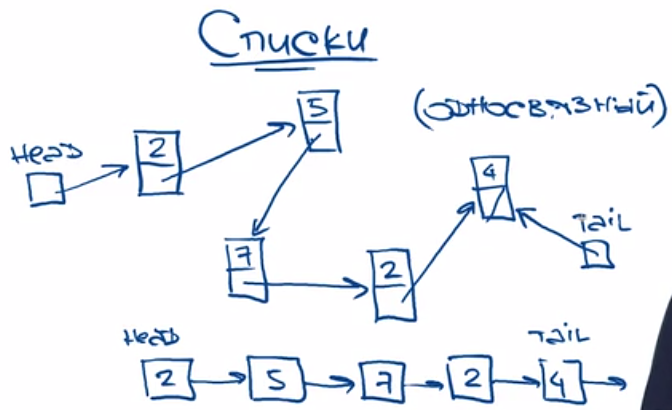
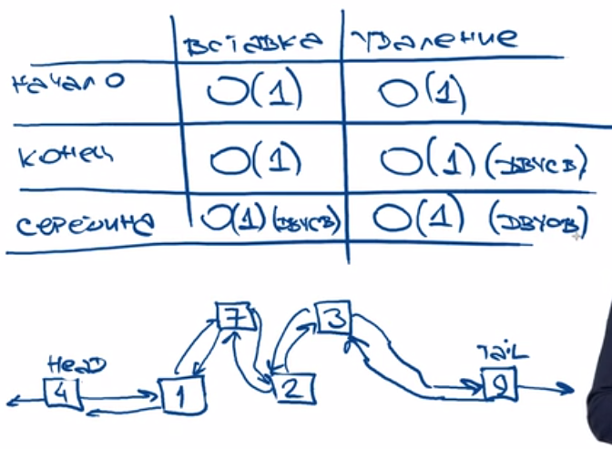

> Элемент списка содержит указатель на следующий/предыдущий элемент и само значение.

> В отличии от массива элементы распологаются хаотично в памяти(то есть при удалении нет необходимости в сдвигах, просто меняем указатели)
 
> Не фиксированный размер 

