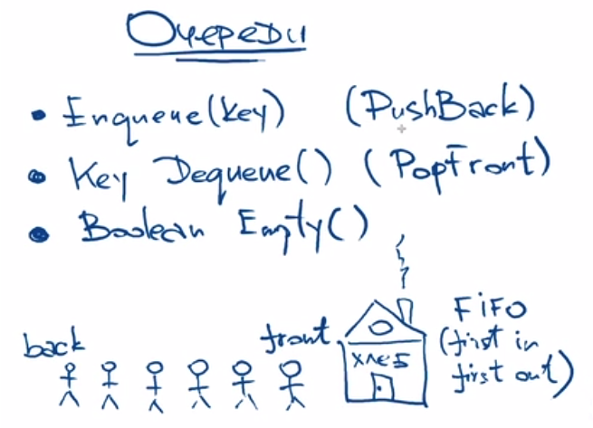

> Реализация

```python
class Node:
    def __init__(self, value):
        self.value = value
        self.next = None

class Queue:
    def __init__(self):
        self.head = None
        self.tail = None
        self.size = 0

    def enqueue(self, item):
        new_node = Node(item)
        if self.head is None:
            self.head = new_node
            self.tail = new_node
        else:
            self.tail.next = new_node
            self.tail = new_node
        self.size += 1

    def dequeue(self):
        if self.head is None:
            return None
        item = self.head.value
        self.head = self.head.next
        self.size -= 1
        return item

    def size(self):
        return self.size
```

> Задача


> <a href=solvings/Queue/WindowSlideMinimum.py>Решение на питоне с подручными методами</a>

```python
sequence = [5, 1, 3, 2, 4, 6, 1, 7, 3, 2, 8]
m = 3
result = []
for i in range(len(sequence) - m + 1):
    result.append(min(sequence[i: i + m]))
print(result)
```