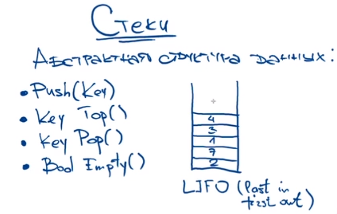
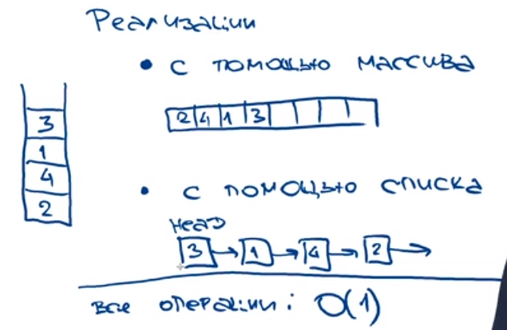
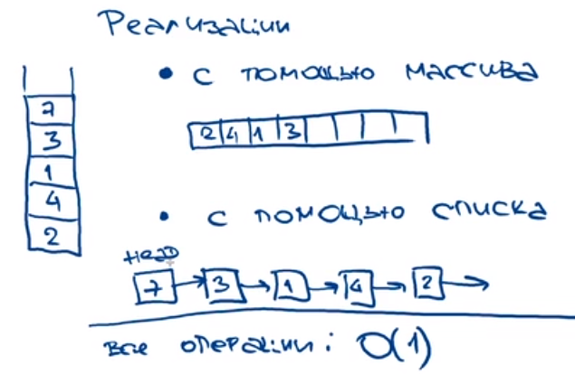
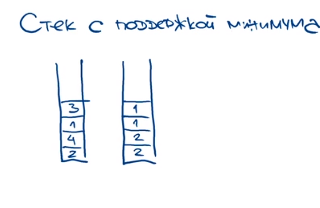
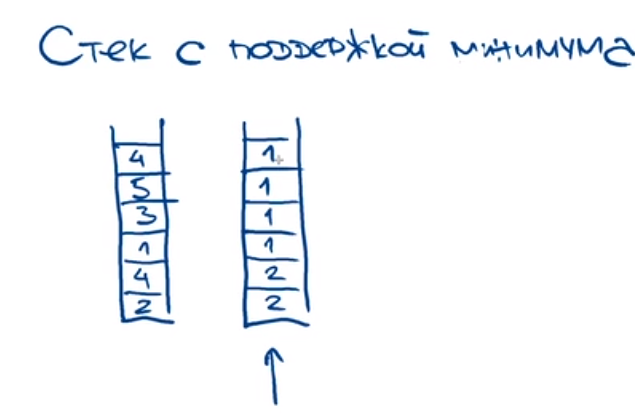
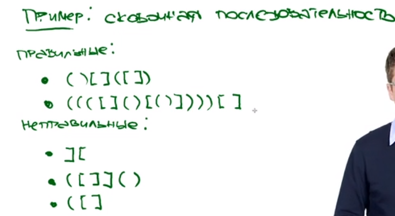

> Реализация





> Stack с поддержкой минимума при каждом добавлении элемента в первый стек, во второй стек ложим 
> тот же элемент, если он меньше определённого во втором стеке минимального элемента из первого.



> На примере видно что минимум не меняется так как при третьем пуше (push(2) -> push(4) -> **push(1)** -> push(3) 
> -> push(5) -> push(4)) мы определили минимальный элемент, который не один из последующих элементов операций push не
> смог перекрыть, то есть все они больше него.



> Классическая задача в которой применяется stack:



> <a href=solvings/Stack/BracketClose.py>Решение со встроенным двусвязным списком</a>

```python
class Stack:
    def __init__(self):
        self.items = []

    def is_empty(self):
        return self.items == []

    def push(self, item):
        self.items.append(item)

    def pop(self):
        return self.items.pop()

    def peek(self):
        return self.items[len(self.items) - 1]

    def size(self):
        return len(self.items)
```

> Решение через nod'ы (элементы со значением + ссылкой на следующий элемент, по-сути односвязный список)

```python
class Node:
    def __init__(self, data):
        self.data = data
        self.next = None


class Stack:
    def __init__(self):
        self.top = None

    def push(self, item):
        new_node = Node(item)
        new_node.next = self.top
        self.top = new_node

    def pop(self):
        if self.top is None:
            return None
        else:
            item = self.top.data
            self.top = self.top.next
            return item

    def peek(self):
        if self.top is None:
            return None
        else:
            return self.top.data

    def is_empty(self):
        return self.top is None
    

def IsBalanced(sequence: str) -> bool:
    stack = Stack()
    for char in sequence:
        if char in ('(', '[', '{'):
            stack.push(char)
        else:
            if stack.is_empty():
                return False
            top = stack.pop()
            if (top == '(' and char != ')') or (top == '[' and char != ']') or (top == '{' and char != '}'):
                return False
    return stack.is_empty()
```