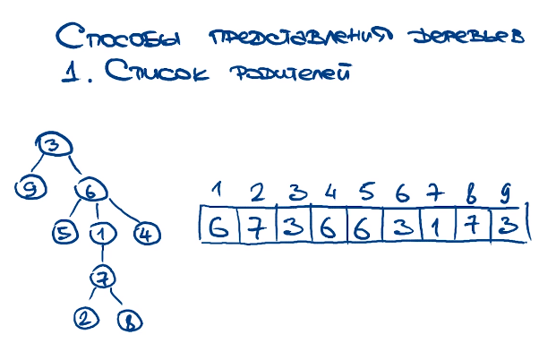
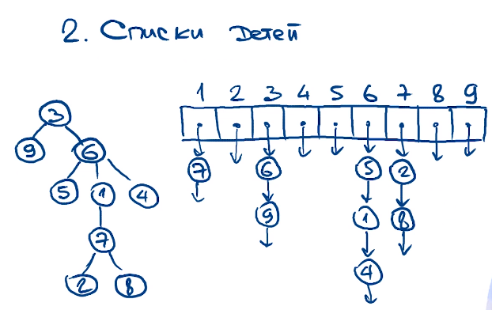
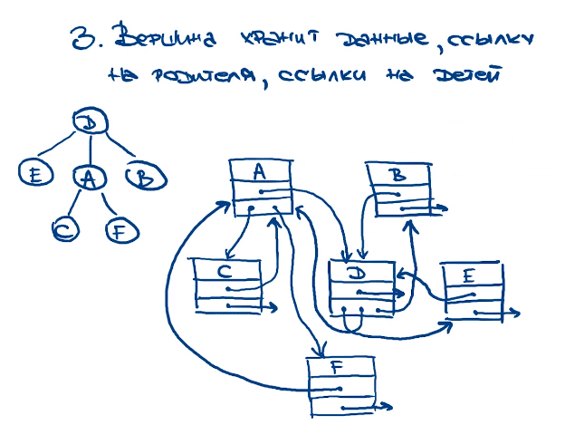
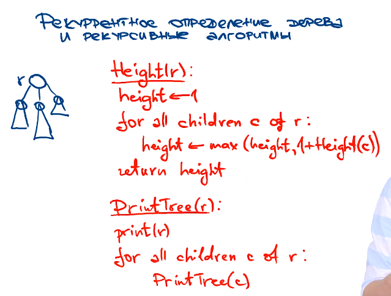

> <a href=solvings/Tree/PrintTree.py>Алгоритм обработки деревьев и вычисление некоторой информации по деревьям</a>



```python
def Height(node):
    if node is None:
        return 0
    else:
        left_height = Height(node.left_child)
        right_height = Height(node.right_child)
        return max(left_height, right_height) + 1


def PrintTree(node):
    if node is not None:
        print(node.value)
        PrintTree(node.left_child)
        PrintTree(node.right_child)
```

> Реализация бинарного дерева

```python
class Node:
    def __init__(self, val: int = None):
        self.value = val
        self.left_child = None
        self.right_child = None


class BinaryTree:
    def __init__(self):
        self.root = None

    @staticmethod
    def insert_left(parent_node, value):
        new_node = Node(value)
        parent_node.left_child = new_node
        return new_node

    @staticmethod
    def insert_right(parent_node, value):
        new_node = Node(value)
        parent_node.right_child = new_node
        return new_node
```

> Реализация Бинарного Дерева Поиска

```python
class Node:
    def __init__(self, value):
        self.value = value
        self.left_child = None
        self.right_child = None

class BinaryTree:
    def __init__(self):
        self.root = None
    
    def insert(self, value):
        if self.root is None:
            self.root = Node(value)
        else:
            self._insert(value, self.root)
    
    def _insert(self, value, current_node):
        if value < current_node.value:
            if current_node.left_child is None:
                current_node.left_child = Node(value)
            else:
                self._insert(value, current_node.left_child)
        elif value > current_node.value:
            if current_node.right_child is None:
                current_node.right_child = Node(value)
            else:
                self._insert(value, current_node.right_child)
        else:
            print("Value already exists in tree")
    
    def search(self, value):
        if self.root is not None:
            return self._search(value, self.root)
        else:
            return False
    
    def _search(self, value, current_node):
        if value == current_node.value:
            return True
        elif value < current_node.value and current_node.left_child is not None:
            return self._search(value, current_node.left_child)
        elif value > current_node.value and current_node.right_child is not None:
            return self._search(value, current_node.right_child)
        else:
            return False
```
